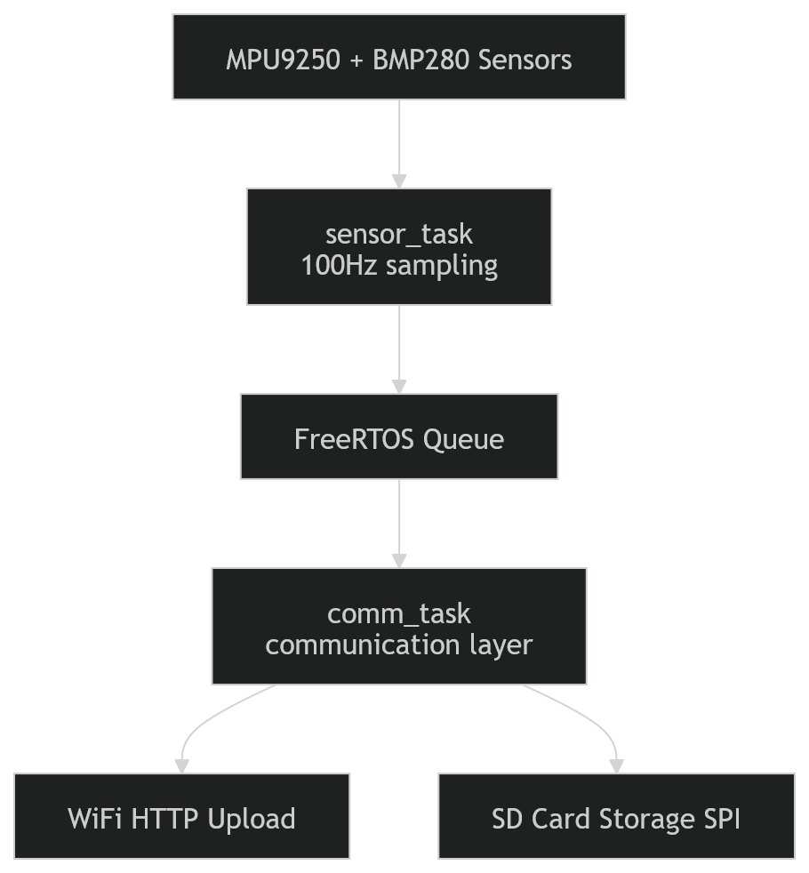

# Arquitetura do Firmware (alto nível)

# Ports
Typical pins for ESP32

SPI usually uses:

MOSI = 23
MISO = 19
SCLK = 18
CS   = 5

I2C sensors:

SDA = 21
SCL = 22

No conflict.

# WIP - Implementation order
## 1: Functional I2C
## 2️ Read and sanity check acc
## 3️ Read and sanity check gyr
## 4️ Read and sanity check mag
## 5️ Read and sanity check BMP280
## 6️ Send via Wi-Fi
## 7 Send via SD card

| Supported Targets | ESP32 | ESP32-C2 | ESP32-C3 | ESP32-C5 | ESP32-C6 | ESP32-C61 | ESP32-S2 | ESP32-S3 |
| ----------------- | ----- | -------- | -------- | -------- | -------- | --------- | -------- | -------- |

# Wi-Fi Station Example

(See the README.md file in the upper level 'examples' directory for more information about examples.)

This example shows how to use the Wi-Fi Station functionality of the Wi-Fi driver of ESP for connecting to an Access Point.

## How to use example

### Configure the project

Open the project configuration menu (`idf.py menuconfig`).

In the `Example Configuration` menu:

* Set the Wi-Fi configuration.
    * Set `WiFi SSID`.
    * Set `WiFi Password`.

Optional: If you need, change the other options according to your requirements.

### Build and Flash

Build the project and flash it to the board, then run the monitor tool to view the serial output:

Run `idf.py -p PORT flash monitor` to build, flash and monitor the project.

(To exit the serial monitor, type ``Ctrl-]``.)

See the Getting Started Guide for all the steps to configure and use the ESP-IDF to build projects.

* [ESP-IDF Getting Started Guide on ESP32](https://docs.espressif.com/projects/esp-idf/en/latest/esp32/get-started/index.html)
* [ESP-IDF Getting Started Guide on ESP32-S2](https://docs.espressif.com/projects/esp-idf/en/latest/esp32s2/get-started/index.html)
* [ESP-IDF Getting Started Guide on ESP32-C3](https://docs.espressif.com/projects/esp-idf/en/latest/esp32c3/get-started/index.html)

