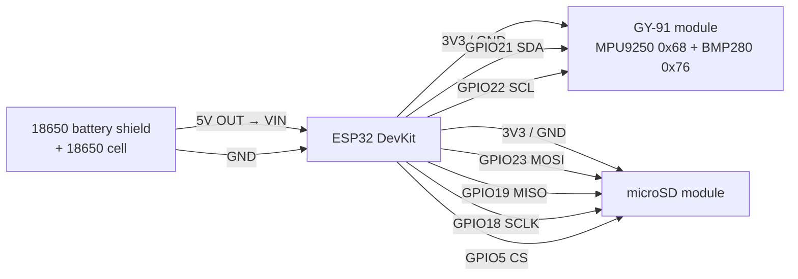

# buoy-sensor-v1 — Wiring Schematic (build handoff)

**MCU:** ESP32 DevKit (3.3 V logic)  
**Power:** **18650 battery shield** (illustrative field power) + **1× 18650** Li-ion cell  
**Sensor module:** **GY-91** (MPU9250 + BMP280 on one board)  
**Storage:** microSD over SPI  
**Firmware:** `packages/firmware/buoy-sensor-v1`

Visual overview: [`docs/buoy-sensor-v1-schematic.png`](docs/buoy-sensor-v1-schematic.png)

---

## Power overview

The **18650 battery shield** is included to show how the buoy is powered in the field:

1. Insert **one 18650** cell into the shield (observe `+` / `-` marking)
2. Shield boosts/regulates to **5 V out**
3. Feed that into ESP32 **VIN** (+ common **GND**)
4. ESP32 onboard regulator makes **3.3 V** for GY-91 + microSD

Charge the shield through its **USB** port when needed. This is an illustration of portable power — exact shield revision (V3/V8/etc.) may vary; always use the **5 V output → ESP32 VIN** pattern.

---

## Important note about MPU9250 + BMP280

The **BMP280 is not inside the MPU9250 IC**. On the popular **GY-91** breakout, both chips sit on the **same PCB** and already share:

- `VIN` / `3V3`
- `GND`
- `SDA`
- `SCL`

So for building, treat sensors as **one module** (4 power/data wires), not two separate boards.  
Firmware still talks to two I2C addresses on that shared bus:

| Chip | I2C address | Role |
|------|-------------|------|
| MPU9250 | `0x68` | accel + gyro (+ mag stubbed) |
| BMP280 | `0x76` | pressure + temperature |

---

## Block diagram

```text
   ┌─────────────────────┐
   │ 18650 battery shield│
   │  + 1× 18650 cell    │
   │  USB charge in      │
   └──────────┬──────────┘
              │ 5V OUT / GND
              ▼
       ┌──────────────┐
       │ ESP32 DevKit │──── 3V3 / GND / SDA21 / SCL22 ──► GY-91
       │ (reg → 3.3V) │
       └──────┬───────┘
              │
              └──── SPI 23/19/18/5 + 3V3/GND ──► microSD
```



---

## ESP32 pin map

| ESP32 pin | Signal | Goes to | Notes |
|-----------|--------|---------|-------|
| **VIN** | 5 V in | Battery shield **5V OUT** | Powers the DevKit; do not also inject 5 V on 3V3 |
| **GND** | Ground | Battery shield GND, GY-91 GND, SD GND | Common ground |
| **3V3** | 3.3 V out | GY-91 `VIN`/`3V3`, SD VCC* | From ESP32 regulator |
| **GPIO21** | I2C SDA | GY-91 **SDA** | Shared by MPU + BMP on module |
| **GPIO22** | I2C SCL | GY-91 **SCL** | Shared by MPU + BMP on module |
| **GPIO23** | SPI MOSI | SD MOSI / DI | |
| **GPIO19** | SPI MISO | SD MISO / DO | |
| **GPIO18** | SPI SCLK | SD SCK / CLK | |
| **GPIO5** | SPI CS | SD CS / SS | Active low |
| USB | UART0 | PC | Flash / monitor (bench). Prefer battery shield USB for charging the cell |

GY-91 usually has onboard I2C pull-ups. Extra external 4.7 kΩ pull-ups are optional unless the bus is long/noisy.

Leave GY-91 `NCS`, `CSB`, and `SDO/SAO` **unconnected** for normal I2C use (board defaults keep MPU at `0x68` and BMP at `0x76`).

---

## Device wiring

### 1) 18650 battery shield — powers ESP32

| Shield item | Connect to / action | Notes |
|-------------|---------------------|-------|
| **18650 cell** | Seat in holder | Match PCB `+` / `-`. **Do not reverse** |
| USB (Micro/Type-C) | Wall charger / PC | Charges the 18650 |
| **5V OUT** (pad or USB-A) | ESP32 **VIN** | Typical DevKit input |
| **GND** | ESP32 **GND** | Required |
| Power button | ON for field use | Many shields need a click/long-press |

Optional: some shields also expose **3V** pads — for this schematic we still power peripherals from the ESP32 **3V3** pin so the DevKit stays the single 3.3 V source.

### 2) GY-91 (MPU9250 + BMP280) — one module, I2C

| GY-91 pin | Connect to | Notes |
|-----------|------------|-------|
| VIN | ESP32 **3V3** | Or 5 V only if module docs say regulator OK |
| 3V3 | leave open | Do not feed 5 V into `3V3` |
| GND | ESP32 **GND** | |
| SDA | ESP32 **GPIO21** | Both chips on this pin |
| SCL | ESP32 **GPIO22** | Both chips on this pin |
| SDO / SAO | leave open | Address select / SPI MISO |
| NCS | leave open | MPU chip-select (SPI) |
| CSB | leave open | BMP chip-select (SPI) |

Expected bring-up:

- MPU `WHO_AM_I = 0x71` (some clones `0x70` / `0x73`) at `0x68`
- BMP chip ID `0x58` at `0x76`

### 3) microSD module — SPI

| Module pin | Connect to | Alt labels |
|------------|------------|------------|
| VCC | ESP32 **3V3** *(or 5V only if the module has an onboard 3.3 V regulator and says so)* | VIN |
| GND | ESP32 **GND** | |
| MOSI | ESP32 **GPIO23** | DI / DIN |
| MISO | ESP32 **GPIO19** | DO / DOUT |
| SCK | ESP32 **GPIO18** | CLK / SCLK |
| CS | ESP32 **GPIO5** | SS |

Card format: **FAT32**. Firmware writes:

`/sdcard/sessions/session_<boot_ms>.csv`

---

## Net list (for wiring / PCB)

| Net | Members |
|-----|---------|
| `+5V_BAT` | Battery shield 5V OUT → ESP32 VIN |
| `GND` | Battery shield GND, ESP32 GND, GY-91 GND, SD GND |
| `+3V3` | ESP32 3V3 → GY-91 VIN, SD VCC* |
| `I2C_SDA` | ESP32 GPIO21, GY-91 SDA |
| `I2C_SCL` | ESP32 GPIO22, GY-91 SCL |
| `SPI_MOSI` | ESP32 GPIO23, SD MOSI |
| `SPI_MISO` | ESP32 GPIO19, SD MISO |
| `SPI_SCLK` | ESP32 GPIO18, SD SCK |
| `SPI_CS_SD` | ESP32 GPIO5, SD CS |

\*Confirm SD breakout voltage requirements before pinning VCC to 3V3 vs 5V.

---

## Build checklist

1. Insert 18650 with correct polarity; turn shield **ON**  
2. Battery shield **5V → ESP32 VIN**, **GND → GND**  
3. Common GND across ESP32 + GY-91 + SD  
4. GY-91 wired with only **VIN, GND, SDA, SCL** for I2C  
5. Leave GY-91 `NCS` / `CSB` / `SDO` unconnected  
6. microSD on SPI pins 23 / 19 / 18 / 5, formatted FAT32  
7. Flash firmware and confirm serial: MPU WHO_AM_I, BMP ID, `SD ready`, `Session CSV opened`

---

## Not wired yet (future)

| Feature | Status |
|---------|--------|
| MPU9250 magnetometer (AK8963 @ `0x0C`) | On the same GY-91; stubbed in firmware for now |
| Wi-Fi antenna / external RF | On-chip / module antenna; no extra GPIO in this schematic |
| Solar / charge management beyond shield USB | Out of scope — shield USB charging is the illustrated path |
